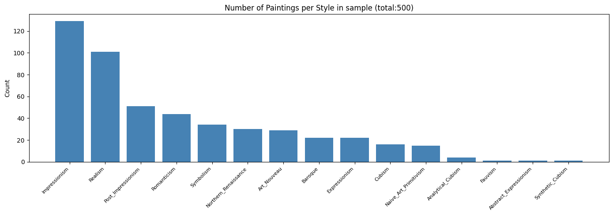
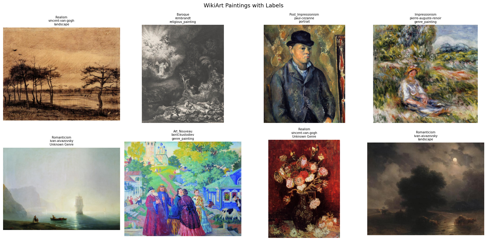
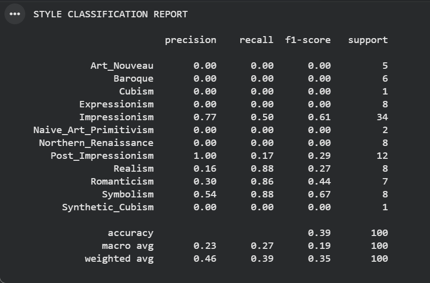
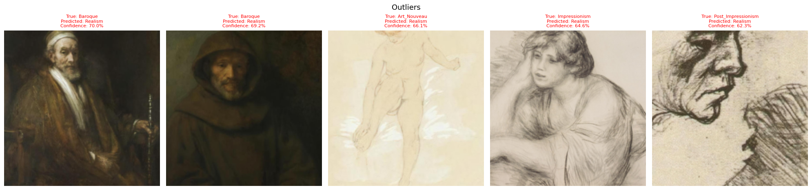

# Test-Tasks-ArtExtract-HumanAI-
Here are the 2 test tasks that were asked to perform to be able to draft a proposal for HumanAI's ArtExtract project

Please download the ipynb file to see the code as preview here unavailable due to meta data

# TASK1: Convolutional-Recurrent Architectures
ArtGAN Dataset: https://github.com/cs-chan/ArtGAN/blob/master/WikiArt%20Dataset/README.md

To do: To build Build a model based on convolutional-recurrent architectures for classifying Style, Artist, Genre, and other attributes. General and Specific. Pick the most appropriate approach and discuss your strategy. discuss which evaluation metrics you are using to evaluate your model performance. Find outliers, e.g. paintings that do not fit a particular artist or genre despite their assignment.

## Architecture
- CRNN - ResNet50 CNN backbone + bidirectional lstm + attention mechanism
- ResNet 50 extracts spatial features by dividing each painting into 49 patches (7x7 grid)
- BiLSTM reads patches in sequence so each patch is aware of its neighbours
- Attention layer learns which patches matter most for classification
- 3 separate head classify style, artist, genre together aka multi task learning

 ## Dataset Findings
- used WikiArt via HuggingFace (500 samples used for this test)
- Found class imbalance - impressionism : 129 paintings, synthetic_cubism: 1
- effects model performance and metric choice

 
 ## Results

 

- Accuracy: 39% (baseline of always predicting Impressionism = 25.8%)
- Macro F1: 0.190
- Weighted F1: 0.347
- Cohen's Kappa: 0.294
- Outliers found: 19 confidently wrong predictions

  

 ## Evaluation Metrics Used & Why

- Accuracy alone is misleading due to class imbalance
- Macro F1 penalises ignoring rare styles equally
- Cohen's Kappa removes credit for random chance
- Outlier detection finds confidently wrong predictions

## Key Findings

- Model learns common styles but ignores rare ones
- 2 outlier paintings appear to be dataset mislabels
- Overfitting observed due to small training set

## What I Would Improve

- Train on full 80,000 painting dataset
- Use weighted loss for rare classes
- Add data augmentation
- Train for more epochs with learning rate scheduling
 
    

