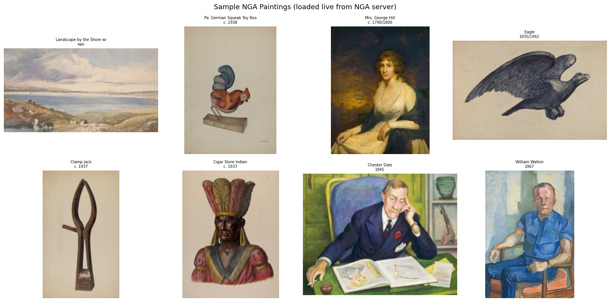
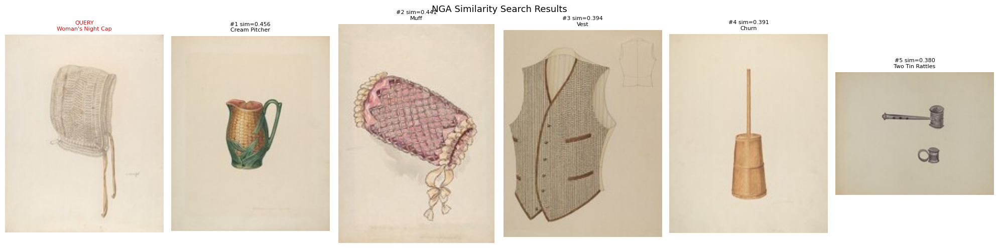
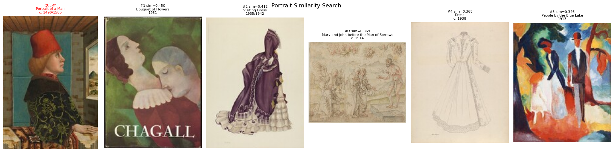
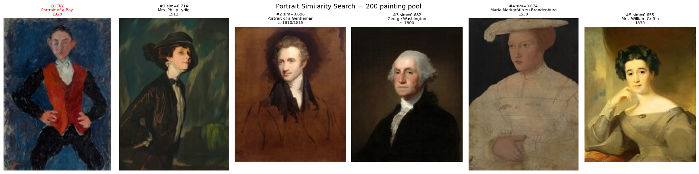
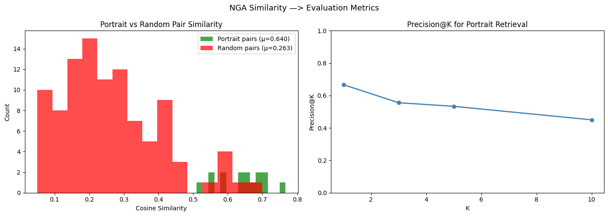

# Test-Tasks-ArtExtract-HumanAI-
Here are the 2 test tasks that were asked to perform to be able to draft a proposal for HumanAI's ArtExtract project

# TASK1: Convolutional-Recurrent Architectures
ArtGAN Dataset: https://github.com/cs-chan/ArtGAN/blob/master/WikiArt%20Dataset/README.md

To do: a model based on convolutional-recurrent architectures for classifying Style, Artist, Genre, and other attributes. General and Specific. Pick the most appropriate approach and discuss your strategy. discuss which evaluation metrics you are using to evaluate your model performance. Find outliers, e.g. paintings that do not fit a particular artist or genre despite their assignment.

## Architecture
- CRNN - ResNet50 CNN backbone + bidirectional lstm + attention mechanism
- ResNet 50 extracts spatial features by dividing each painting into 49 patches (7x7 grid)
- BiLSTM reads patches in sequence so each patch is aware of its neighbours
- Attention layer learns which patches matter most for classification
- 3 separate head classify style, artist, genre together aka multi task learning

 ## Dataset Findings
- used WikiArt via HuggingFace (500 samples used for this test)
- Found class imbalance - impressionism : 129 paintings, synthetic_cubism: 1
- effects model performance and metric choice

 
 ## Results

 

- Accuracy: 39% (baseline of always predicting Impressionism = 25.8%)
- Macro F1: 0.190
- Weighted F1: 0.347
- Cohen's Kappa: 0.294
- Outliers found: 19 confidently wrong predictions

  

 ## Evaluation Metrics Used & Why

- Accuracy alone is misleading due to class imbalance
- Macro F1 penalises ignoring rare styles equally
- Cohen's Kappa removes credit for random chance
- Outlier detection finds confidently wrong predictions

## Key Findings

- Model learns common styles but ignores rare ones
- 2 outlier paintings appear to be dataset mislabels
- Overfitting observed due to small training set

## What I Would Improve

- Train on full 80,000 painting dataset
- Use weighted loss for rare classes
- Add data augmentation
- Train for more epochs with learning rate scheduling

# Task 2: Painting Similarity Search (National Gallery of Art)
To do: Build a model to find similarities in paintings, e.g. portraits with a similar face or pose.. Pick the most appropriate approach and discuss your strategy

Dataset: https://github.com/NationalGalleryOfArt/opendata

  

## Architecture
A similarity search system using DINOv2 embeddings + cosine similarity.
- No training required — DINOv2 pretrained on 142M images by Meta AI
- Each painting encoded as a 384-dimensional embedding vector
- Cosine similarity finds the most visually similar paintings

### Visual Observations
 
 Good similarity but not portraits 

  
  Poor similarity scores hence need to use more data/ paintings
  
  
  Good similarity scores achieved 

### Results
| Metric | Score |
|--------|-------|
| Mean Precision@5 | 0.533 |
| Portrait pair similarity | 0.640 |
| Random pair similarity | 0.263 |
| Similarity gap | 0.377 |

 

### Why These Metrics
- Precision@K: no ground truth labels exist so relevance defined by painting type
- Similarity gap: proves embedding space has genuine visual structure
- No accuracy metric — this is unsupervised similarity not classification

### Key Findings
- Portrait pairs score 2.4x higher similarity than random pairs with zero training
- Pool size matters — 50 paintings gave poor results, 200 gave strong portrait matches
- DINOv2 finds visual similarity purely from image content, no labels needed

### What I Would Improve
- Embed full 22,579 paintings instead of 200
- Add face detection for face-specific similarity
- Add FAISS index for fast search over full collection
- Use larger DINOv2 model for richer embeddings

---

## Files
| File | Description |
|------|-------------|
| `Task1(CRNN)_ArtExtract.ipynb` | WikiArt CRNN classifier notebook |
| `Task1(CRNN)_ArtExtract.pdf` | PDF with full output |
| `Task2_ArtExtract.ipynb` | NGA similarity search notebook |
| `Task2_ArtExtract.pdf` | PDF with full output |

---

## How to Run
Both notebooks are self-contained and run on Google Colab with a free T4 GPU.
1. Open notebook in Colab
2. Runtime → Change runtime type → T4 GPU
3. Run all cells top to bottom

 
    

